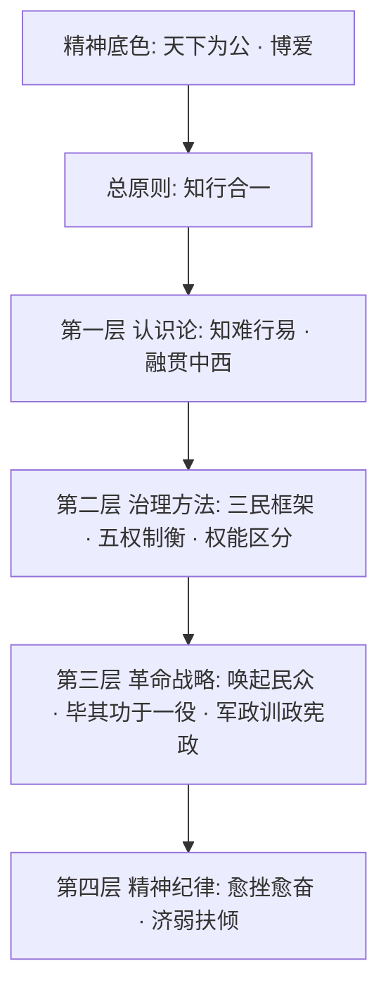

# 大同 Skill（datong-skill）—— 天下为公 · 全量实现计划

> "人类进化之目的为何？即孔子所谓'大道之行也，天下为公'，耶稣所谓'尔旨得成，在地若天'，此人类所希望，化现在之痛苦世界而为极乐之天堂者是也。"
> —— 孙中山《建国方略·孙文学说》

`datong-skill/` 目录已被清理，需要全部从零重新创建。跳过 GitHub 发布阶段。

---

## 红线声明（MUST READ）

本项目**严格遵守**以下边界，任何贡献和修改都不得逾越：

1. **纯方法论蒸馏** —— 我们学习的是孙中山先生的思维方式、行动策略和精神力量，不涉及任何政治立场、政党评价或制度优劣比较
2. **不涉及敏感政治内容** —— 不评论、不暗示任何关于两岸关系、政党合法性、政权更迭等敏感议题
3. **不得出现反动或反华言论** —— 所有内容必须客观、正面地呈现历史人物的方法论智慧，不得借历史人物之名发表任何带有政治倾向的观点
4. **尊重历史、实事求是** —— 引用原文必须标注出处，不曲解、不断章取义；呈现历史背景仅为解释方法论的产生语境
5. **面向 AI 工作场景** —— 所有方法论的"适用场景"限定在软件工程、系统设计、团队协作等 AI agent 工作领域，不延伸到现实政治讨论

**一言蔽之：我们敬仰孙中山先生的精神，学习他的方法，不做任何政治解读。**

---

## 项目命名：datong-skill

**大同**，是孙中山先生毕生追求的终极理想。

孙中山先生一生题写"天下为公"匾额无数，遍赠友人。他明确说："真正的民生主义，就是孔子所希望之大同世界。"又说："三民主义的意思，就是民有、民治、民享。……人民对于国家不只是共产，一切事权都是要共的。这才是真正的民生主义，就是孔子所希望之大同世界。"

"大同"不是空洞的口号——它是三民主义的归宿，是"天下为公"精神的体现，是孙中山先生融贯中西、百折不挠、四十年革命生涯所追求的那个"极和平、极自由、极平等的国家"。

---

## 蒸馏对象

**孙中山**（1866-1925），名文，字逸仙，号日新。

中国民主革命的伟大先行者。幼年赤足穷乡，少年留学檀香山，青年行医救人，壮年奔走革命。从兴中会到同盟会，从辛亥首义到二次革命，从护法运动到改组国民党——四十年间，十次起义、两次流亡、无数挫折，矢志不渝。

> "惟我辈既以担当中国改革发展为己任，虽石烂海枯，而此身尚存，此心不死。既不可以失败而灰心，亦不能以困难而缩步。精神贯注，猛力向前，应乎世界进步之潮流，合乎善长恶消之天理，则终有最后成功之一日。"

**我们蒸馏的不是孙中山的政治身份，而是他的精神遗产和方法论智慧：**

- 从"天下为公"到三民主义——如何从一个崇高理想推导出可落地的系统框架
- 从"知难行易"到实业计划——如何打破认知障碍，以行动产生真知
- 从"融贯中西"到五权宪法——如何博采众长而不失本体
- 从"唤起民众"到统一战线——如何联合一切可以联合的力量
- 从"革命尚未成功"到遗嘱——如何在极度困难中坚持长期目标

---

## 精神底色

### 天下为公 · 博爱

> "国家非一人之天下，非一家之天下，非一党之天下，非一族之天下，非一教之天下，乃天下人之天下，天下为公。"

> "吾志所向，一往无前；愈挫愈奋，再接再励。"

辛亥革命元老何子渊诠释孙中山"天下为公"时说：

> "万物依本性各行其道而不相害，道并行而不相悖。《论语》言，和而不同。这便是真包容，这便是天下为公。"

这种精神不是空谈——它要求**先向善、后求真；先去私欲、后做判断**。在 AI agent 的工作场景中，这意味着：每一个决策都要考虑其对全体用户和整个系统的影响，而不只是眼前的局部需求。

---

## 总原则：知行合一

> "夫心也者，万事之本源也。吾心信其可行，则移山填海之难，终有成功之日；吾心信其不可行，则反掌折枝之易，亦无收效之期也。"
> —— 《建国方略·孙文学说》

孙中山的核心认识论命题是**知难行易**——"不经一事，不长一智"，认识从行动中来，但形成正确的认识才是真正的难关。这不是鼓吹蛮干，而是破除"知之非艰，行之惟艰"的畏难心理，鼓励**先行动、在行动中认识、在认识中改进行动**。

**行动先于完美方案。实践产生真知。如果行动结果与预期冲突，修改的是方案，不是回避行动。但一旦形成了正确的认识，就要坚信它、贯彻它——"心信其可行"。**

---

## 方法论体系



### 第一层：认识论——分析任何问题的底层框架

#### 1. 知难行易（know-hard-act-easy）

> "当科学未发明之前，固全属不知而行，及行之而犹有不知者。……迨人类渐起觉悟，始有由行而后知者。"

**核心要义：** 行动先于完美认知。真正的困难不在于"做"，而在于"知道该做什么"。一旦认识清楚了，行动自然顺畅。因此：遇到不确定时，先行动获取信息，而非等待完美方案。

**适用场景：** 面对复杂问题犹豫不决、陷入"分析瘫痪"、因畏难而迟迟不动手时。

#### 2. 融贯中西（east-west-synthesis）

> "余之谋中国革命，其所持主义，有因袭吾国固有之思想者，有规抚欧洲之学说事迹者，有吾所独见而创获者。"
> "发扬吾固有文化，并吸收世界文化而光大之，以期与诸民族并驾于世界。"

**核心要义：** 不盲从外来方法，也不固守已有方式。取各家之长融为己用，但融合的前提是深入理解双方，而非浮光掠影。"固有的东西，如果是好的，当然是要保存，不好的才可以放弃。"

**适用场景：** 技术选型、架构设计、方案权衡——需要在多种方法论/框架/范式之间做选择时。

### 第二层：治理方法——设计和运行系统的基本方法

#### 3. 三民框架（three-principles-analysis）

> "民族即民有也……民权即民治也……民生即民享也"
> "三民主义的精神，就是要建设一个极和平、极自由、极平等的国家。"

**核心要义：** 任何系统性问题可从三个维度分析——**谁的**（所有权与身份）、**谁治理**（决策与权力结构）、**谁受益**（价值分配与福祉）。三者一贯，缺一不可：只有所有权而无治理权是空壳；有治理权而利益不共享是专制；利益均沾而没有主体性是依附。

**适用场景：** 系统设计评审、需求分析、架构决策——需要全面审视一个方案是否兼顾了各方利益时。

#### 4. 五权制衡（five-power-checks）

> 行政、立法、司法之外，加考试、监察二权。

**核心要义：** 系统需要多维度的独立质量保障机制，而非把所有权力集中在一处。孙中山在西方三权分立基础上增加了中国传统的考试（选拔）和监察（纠错）维度。对于 AI 工作：执行、规划、验证、选拔（评估最优方案）、监察（事后审查）应当分开进行。

**适用场景：** 代码审查、质量保障、流程设计——需要建立系统性的检查与平衡机制时。

#### 5. 权能区分（power-capability-split）

> "用人民的四个政权，来管理政府的五个治权，那才算是一个完全的民权政治机关。"

**核心要义：** 明确区分**决策权**（属于用户/委托方——选举、罢免、创制、复决）与**执行能力**（属于执行者——行政、立法、司法、考试、监察）。既不越权——不替用户做应由用户做的决定；也不推责——在自己的执行范围内充分发挥能力。

**适用场景：** 角色分工、权限设计、与用户的协作关系界定——需要明确"谁决定"和"谁执行"时。

### 第三层：革命战略——面对具体任务的行动指导

#### 6. 唤起民众（awaken-and-unite）

> "余致力国民革命，凡四十年，其目的在求中国之自由平等。积四十年之经验，深知欲达到此目的，**必须唤起民众及联合世界上以平等待我之民族，共同奋斗**。"
> —— 总理遗嘱（1925年）

**核心要义：** 孤军奋战不可能成功。要达成目标，必须做两件事：**唤起**——让相关方理解问题并愿意参与；**联合**——找到所有"以平等待我"的力量，建立统一战线。这是孙中山四十年革命经验的最终总结，也是他留给后人最重要的方法论遗产。

**适用场景：** 跨团队协作、技术方案推广、开源项目运营——需要争取多方支持、建立联盟时。

#### 7. 毕其功于一役（single-stroke-revolution）

> "我们革命之后要实行民生主义……把全国大矿业、大工业、大商业、大交通都由国家经营。"
> "要把工业革命与社会革命，毕其功于一役。"

**核心要义：** 当多个维度的问题互相关联时，不要枝节片断地修补，而要一次性系统解决。孙中山主张中国革命同时进行民族革命、政治革命和社会革命，避免走西方"先革命再改革"的弯路。

**适用场景：** 重构、迁移、技术债务清理——可以一次性系统解决多个互相牵扯的问题时。

#### 8. 三阶段推进（three-phase-governance）

> "军政→训政→宪政"
> —— 《建国大纲》

**核心要义：** 任何深刻的变革不可能一步到位，需要经历三个阶段：**破旧立新期**（强制推行，打破旧制度）→ **教育培养期**（引导学习，建立新习惯）→ **制度自治期**（规则内化，实现自运转）。急于跳过中间阶段，制度就无法扎根。

**适用场景：** 新技术规范推行、团队工作方式转型、大型迁移项目——需要分阶段稳步推进变革时。

### 第四层：精神纪律——穿越困难的精神力量

#### 9. 愈挫愈奋（rise-from-defeat）

> "惟我辈既以担当中国改革发展为己任，虽石烂海枯，而此身尚存，此心不死。"
> "革命尚未成功，同志仍须努力。"
> "我只能这样说：不管革命失败有多少次，但是我总希望中国的革命能成功，所以便不能不这样奋斗。"

**核心要义：** 孙中山一生经历无数失败——十次起义失败、两次流亡海外、信任的人叛变。但他从未放弃。"既不可以失败而灰心，亦不能以困难而缩步"——失败不是终点，是认识深化的过程。每次失败后要做的不是放弃，而是**总结经验、调整方法、重新出发**。

**适用场景：** 方案被否决、实现遇到严重阻碍、多次尝试都失败时——需要精神力量继续推进。

#### 10. 济弱扶倾（aid-the-weak）

> "中国如果强盛起来，我们不但是要恢复民族的地位，还要对于世界负一个大责任。"
> "聪明才智越大者，当服千万人之务，造千万人之福。"

**核心要义：** 强者有责任帮助弱者。能力越大，责任越大。系统的公平性、对弱势用户的关怀、对边缘场景的覆盖，都比单纯追求效率和性能更重要。天下为公，不是空谈——它意味着你做的每一个决定，都要考虑那些"全无能力者"是否也能受益。

**适用场景：** 可访问性设计、向下兼容、技术普惠——需要审视方案是否照顾到了最弱势的使用者时。

---

## 项目结构

```
datong-skill/
+-- skills/
|   +-- tianxia-weigong/               # 入口：天下为公（路由与总原则）
|   |   +-- SKILL.md
|   +-- know-hard-act-easy/            # 知难行易
|   |   +-- SKILL.md
|   |   +-- original-texts.md          # 《孙文学说》原文摘录
|   +-- east-west-synthesis/           # 融贯中西
|   |   +-- SKILL.md
|   |   +-- original-texts.md
|   +-- three-principles-analysis/     # 三民框架
|   |   +-- SKILL.md
|   |   +-- original-texts.md          # 三民主义讲演原文摘录
|   +-- five-power-checks/            # 五权制衡
|   |   +-- SKILL.md
|   |   +-- original-texts.md
|   |   +-- quality-review-prompt.md   # 五权审查 subagent prompt
|   +-- power-capability-split/       # 权能区分
|   |   +-- SKILL.md
|   |   +-- original-texts.md
|   +-- awaken-and-unite/             # 唤起民众
|   |   +-- SKILL.md
|   |   +-- original-texts.md          # 总理遗嘱、新三民主义原文
|   +-- single-stroke-revolution/     # 毕其功于一役
|   |   +-- SKILL.md
|   |   +-- original-texts.md
|   +-- three-phase-governance/       # 三阶段推进
|   |   +-- SKILL.md
|   |   +-- original-texts.md          # 《建国大纲》原文摘录
|   |   +-- phase-assessment-guide.md
|   +-- rise-from-defeat/             # 愈挫愈奋
|   |   +-- SKILL.md
|   |   +-- original-texts.md          # 遗嘱、书信、名言
|   +-- aid-the-weak/                 # 济弱扶倾
|   |   +-- SKILL.md
|   |   +-- original-texts.md
|   +-- workflows/                    # 工作流组合
|       +-- SKILL.md
+-- commands/                          # 手动 slash commands
+-- hooks/                             # Session 注入
+-- agents/                            # Subagent prompts
+-- tests/                             # 验证脚本
+-- docs/                              # 文档站点
+-- .claude-plugin/plugin.json
+-- .cursor-plugin/plugin.json
+-- package.json
+-- CHANGELOG.md
+-- LICENSE (MIT)
+-- README.md
+-- PLAN.md
```

---

## 参考资料清单

### 孙中山先生原著

| 文献                   | 蒸馏用途                                           |
| -------------------- | ---------------------------------------------- |
| 《孙文学说》（《建国方略·心理建设》）  | "知难行易"哲学——know-hard-act-easy 的核心依据             |
| 《三民主义》十六讲（1924年广州演讲） | 民族、民权、民生的系统论述——three-principles-analysis 的核心依据 |
| 《建国大纲》（1924年）        | 军政、训政、宪政三阶段——three-phase-governance 的核心依据      |
| 《实业计划》（《建国方略·物质建设》）  | 系统规划与"毕其功于一役"——single-stroke-revolution 的依据    |
| 《民权初步》（《建国方略·社会建设》）  | 民主实践方法——power-capability-split 的依据             |
| 《民报发刊词》（1905年）       | 三民主义首次系统表述                                     |
| 总理遗嘱（1925年3月11日签署）   | "唤起民众及联合世界上以平等待我之民族"——awaken-and-unite 的核心依据   |
| 国民党一大宣言（1924年）       | 新三民主义——联俄、联共、扶助农工                              |
| 五权宪法相关论述             | five-power-checks 的核心依据                        |

### 百科、传记与研究

- [孙中山 - 维基百科](https://zh.wikipedia.org/zh-cn/%E5%AD%AB%E4%B8%AD%E5%B1%B1)
- [三民主义 - 维基百科](https://zh.wikipedia.org/wiki/%E4%B8%89%E6%B0%91%E4%B8%BB%E7%BE%A9)
- [孙文 - 维基语录](https://zh.m.wikiquote.org/wiki/%E5%AD%AB%E4%B8%AD%E5%B1%B1)
- [天下为公 - 维基百科](https://zh.wikipedia.org/wiki/%E5%A4%A9%E4%B8%8B%E7%82%BA%E5%85%AC)
- [孙中山先生名言录 - 中国教育](https://www.edu.cn/personage_11520/20110615/t20110615_634855.shtml)
- [孙中山：统一是中国全民的希望 - 辛亥革命网](http://www.xhgmw.com/html/xinhaijinian/wenzhang/2024/0705/29966.html)
- [总理遗嘱 - 维基百科](https://zh.wikipedia.org/wiki/%E6%80%BB%E7%90%86%E9%81%97%E5%98%B1)
- 白吉尔《孙逸仙》传记
- 李菁《天下为公：孙中山传》

### 孙中山先生名言摘录（用于各 skill 引用）

**关于信念与行动：**

- "吾心信其可行，则移山填海之难，终有成功之日；吾心信其不可行，则反掌折枝之易，亦无收效之期也。"
- "吾志所向，一往无前；愈挫愈奋，再接再励。"
- "当立心做大事，不立心做大官。"
- "惟愿诸君将振兴中国之责任，置之于自身之肩上。"

**关于天下为公：**

- "国家非一人之天下，非一家之天下，非一党之天下，非一族之天下，非一教之天下，乃天下人之天下，天下为公。"
- "人类进化之原则与物种进化之原则不同，物种以竞争为原则，人类则以互助为原则。"
- "聪明才智越大者，当服千万人之务，造千万人之福。"

**关于革命与坚持：**

- "革命尚未成功，同志仍须努力。"
- "既不可以失败而灰心，亦不能以困难而缩步。精神贯注，猛力向前。"
- "必须唤起民众及联合世界上以平等待我之民族，共同奋斗。"
- "我只能这样说：不管革命失败有多少次，但是我总希望中国的革命能成功，所以便不能不这样奋斗。"
- "我死了之后，四面都是敌人，你们千万不要被敌人软化！"

**关于融贯中西：**

- "余之谋中国革命，其所持主义，有因袭吾国固有之思想者，有规抚欧洲之学说事迹者，有吾所独见而创获者。"
- "固有的东西，如果是好的，当然是要保存，不好的才可以放弃。"

**关于三民主义：**

- "三民主义的意思，就是民有、民治、民享。国家是人民所共有，政治是人民所共管，利益是人民所共享。"
- "三民主义的精神，就是要建设一个极和平、极自由、极平等的国家。"
- "民生便是一种伦理力，是运用伦理的方式，使各阶级合作和谐，而绝不是各阶级互相仇视而益形分裂。"

---

## 设计原则

1. **每条方法论都有据可依** —— 所有引文标注篇名和年份，收录于各 skill 目录下的 `original-texts.md`
2. **红线不可逾越** —— 纯方法论蒸馏，不涉及任何政治立场、政党评价、敏感议题
3. **天下为公是精神，不是教条** —— 每个 skill 有明确的"不适用场景"，避免形式化全套调用
4. **入口轻量、按需加载** —— `tianxia-weigong` 入口 skill 只做路由和总原则约束
5. **独立自主的方法论体系** —— 扎根于孙中山先生自己的思想，不是其他项目的翻版

---

## 实施步骤

### 阶段一：框架搭建

在 `/Users/ctenetliu/Projects/Persona/datong-skill/` 下创建：

- 完整目录结构（skills/ 含 12 个子目录、commands/、hooks/、agents/、tests/、docs/、.claude-plugin/、.cursor-plugin/）
- `package.json` - 项目元信息
- `LICENSE` - MIT 协议
- `.gitignore`
- `hooks/hooks.json` - SessionStart 钩子指向入口 skill
- `.claude-plugin/plugin.json` + `.cursor-plugin/plugin.json` - 平台插件配置
- `PLAN.md` - 本计划文档副本

### 阶段二：入口 Skill + 10 个核心方法论 Skill

每个 skill 包含 `SKILL.md`（含 YAML frontmatter）+ `original-texts.md`（原文摘录含出处）。

**入口 skill：**
- `skills/tianxia-weigong/SKILL.md` -- 入口路由器 + 红线 + 精神底色 + 总原则 + 方法论路由表 + 组合使用指南

**10 个核心方法论 skill（分三批并行编写）：**

批次一：
- `skills/know-hard-act-easy/` -- 知难行易（认识论层）
- `skills/east-west-synthesis/` -- 融贯中西（认识论层）
- `skills/three-principles-analysis/` -- 三民框架（治理方法层）

批次二：
- `skills/five-power-checks/` -- 五权制衡（治理方法层）+ `quality-review-prompt.md`
- `skills/power-capability-split/` -- 权能区分（治理方法层）
- `skills/awaken-and-unite/` -- 唤起民众（革命战略层）

批次三：
- `skills/single-stroke-revolution/` -- 毕其功于一役（革命战略层）
- `skills/three-phase-governance/` -- 三阶段推进（革命战略层）+ `phase-assessment-guide.md`
- `skills/rise-from-defeat/` -- 愈挫愈奋（精神纪律层）
- `skills/aid-the-weak/` -- 济弱扶倾（精神纪律层）

每个 SKILL.md 统一结构：
- YAML frontmatter (name + description)
- 红线提示（简短引用总入口红线）
- 核心原文引用（含出处）
- 核心要义
- 操作步骤（step-by-step）
- 适用场景 + 不适用场景
- 常见误用
- 与其他方法的组合建议

### 阶段三：工作流 + 辅助文件

- `skills/workflows/SKILL.md` -- 端到端工作流串联（系统设计评审流、变革推进流、危机应对流等）
- `commands/` -- 手动触发命令（如 datong-analyze、datong-review 等）
- `agents/` -- subagent prompts（如五权审查 agent）

### 阶段四：README + 工程配套

- `README.md` -- 项目介绍、方法论一览、安装使用、红线声明
- `CHANGELOG.md`
- `docs/` -- 简要文档
- `tests/` -- 验证脚本

（跳过阶段五：GitHub 发布，后续再做）
