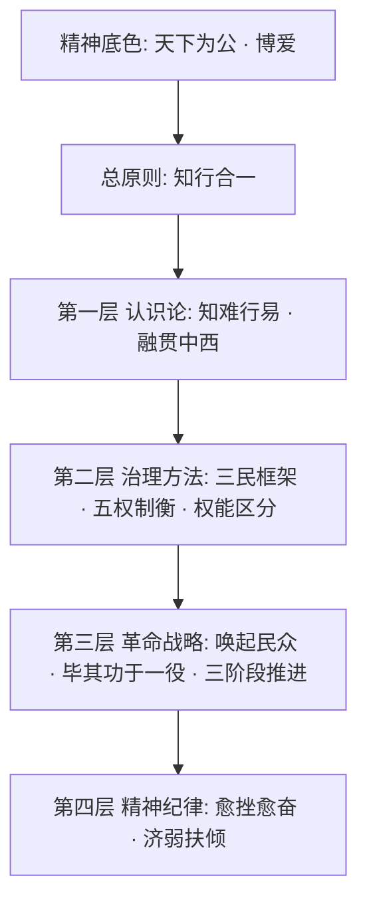

<p align="center">
  
</p>

# 大同.Skill —— 天下为公

> "吾志所向，一往无前；愈挫愈奋，再接再励。"

> "吾心信其可行，则移山填海之难，终有成功之日。"

---

**你的 AI 不应该只会执行。它应该知道为谁而做、如何做对、遇到困难怎么穿越。**

「大同 Skill」是一个 AI Agent Skills 合集，从孙中山先生四十年革命生涯中蒸馏出一条总原则和十大方法论工具，系统性地提升 AI 的分析力、设计力和韧性。不是口号，不是鸡汤，而是可操作的思维工具箱。

每一条方法都有据可依、有迹可循，直接引用孙中山先生原著原文（详见各 skill 目录下的 `original-texts.md`）。

## 红线声明

本项目**严格遵守**以下边界：

- **纯方法论蒸馏** —— 学习思维方式和行动策略，不涉及任何政治立场、政党评价或制度优劣比较
- **尊重历史、实事求是** —— 引用原文标注出处，不曲解、不断章取义
- **面向 AI 工作场景** —— 适用场景限定在软件工程、系统设计、团队协作领域

**我们敬仰孙中山先生的精神，学习他的方法论与精神。继往圣之绝学 开万世之太平**

## 为什么需要这个？

当前的 AI Agent 有几个常见短板：

- 面对不确定性就陷入"分析瘫痪"，迟迟不敢行动
- 技术选型只看热度不看本质，缺乏深度融合的判断力
- 系统设计只考虑功能实现，不考虑"这是谁的系统、谁在治理、谁受益"
- 执行者和决策者角色不清，要么越权要么推责
- 推行变革只有第一步没有后续，新规范推了就没人管
- 遇到失败就放弃，缺乏从失败中提取新认识的能力
- 只为主流用户设计，忽略最弱势的使用者

孙中山先生的方法论——知难行易、融贯中西、三民框架、五权制衡、唤起民众、愈挫愈奋——恰恰解决的就是"怎么想问题、怎么推进、怎么穿越困难"这些根本问题。

**这不是 Politics，这是 Methodology。**

## 方法结构




**总原则 —— 知行合一**

- "吾心信其可行，则移山填海之难，终有成功之日。" 行动先于完美方案，实践产生真知，认识成型后坚定执行。

**第一层 · 认识论** —— 分析任何问题的底层框架

- **知难行易**：遇到不确定先行动获取信息，不等完美方案。"知之非艰，行之惟艰，此古人之大谬也。"
- **融贯中西**：取各家之长融为己用，但融合的前提是深入理解双方。"固有的东西，好的要保存，不好的才放弃。"

**第二层 · 治理方法** —— 设计和运行系统的基本方法

- **三民框架**：谁的、谁治理、谁受益——三维缺一不可。"民有、民治、民享。"
- **五权制衡**：执行、规划、验证、选拔、监察分离。"在外国的规模之上更加一层中国的特色。"
- **权能区分**：决策权归用户，执行力归 agent。"用人民的四个政权，来管理政府的五个治权。"

**第三层 · 革命战略** —— 面对具体任务的行动指导

- **唤起民众**：唤起相关方理解问题，联合一切平等力量。"必须唤起民众及联合世界上以平等待我之民族，共同奋斗。"
- **毕其功于一役**：关联问题一次性系统解决，不做枝节修补。
- **三阶段推进**：破旧立新 → 教育培养 → 制度自治，不跳阶段。

**第四层 · 精神纪律** —— 穿越困难的精神力量

- **愈挫愈奋**：失败是认识深化，总结后重新出发。"既不可以失败而灰心，亦不能以困难而缩步。"
- **济弱扶倾**：能力越大责任越大，为最弱势使用者设计。"聪明才智越大者，当服千万人之务，造千万人之福。"

## 十大方法论工具


| 方法     | 核心要义          | 原著出处        | 适用场景        |
| ------ | ------------- | ----------- | ----------- |
| 知难行易   | 行动先于完美认知      | 《建国方略·孙文学说》 | 分析瘫痪、畏难不前   |
| 融贯中西   | 深入理解后创造性融合    | 《三民主义·民族主义》 | 技术选型、架构设计   |
| 三民框架   | 谁的、谁治理、谁受益    | 《三民主义》十六讲   | 系统设计评审、需求分析 |
| 五权制衡   | 五种职能分离独立运行    | 《五权宪法》演讲    | 代码审查、质量保障   |
| 权能区分   | 决策权 vs 执行力    | 《三民主义·民权主义》 | 角色分工、权限设计   |
| 唤起民众   | 唤起 + 联合平等力量   | 总理遗嘱（1925）  | 跨团队协作、方案推广  |
| 毕其功于一役 | 关联问题系统性解决     | 《民报发刊词》     | 重构、迁移、债务清理  |
| 三阶段推进  | 破旧 → 培育 → 自治  | 《建国大纲》      | 规范推行、团队转型   |
| 愈挫愈奋   | 复盘 → 新认识 → 重启 | 总理遗嘱 / 致友人书 | 方案被否、多次失败   |
| 济弱扶倾   | 从最弱势视角审视方案    | 《三民主义·民族主义》 | 可访问性、向下兼容   |


> 另有 `skills/workflows/SKILL.md` 作为跨 skill 编排层，定义三种标准工作流：系统设计评审流、变革推进流、危机应对流。

## 安装

### 系统要求

- **Windows**：默认使用 PowerShell hook，无需额外安装 Bash
- **macOS / Linux**：需要可用的 `bash` 或 `sh`
- **验证脚本**：仓库内置 `tests/validate-structure.sh`（macOS/Linux），可用于安装后自检

### 方式一：环境与插件安装

#### Claude Code

**方法 A：源码克隆安装（推荐）**

```bash
git clone https://github.com/user/datong-skill
cd datong-skill
claude --plugin-dir .
```

`--plugin-dir` 会在当前会话加载插件。如需每次会话都自动加载，可以设置 shell alias：

```bash
# 加入 ~/.bashrc 或 ~/.zshrc
alias claude='claude --plugin-dir /path/to/datong-skill'
```

**macOS / Linux 验证：**

```bash
bash tests/validate-structure.sh
```

- hook 入口使用 `hooks/session-start`（POSIX shell 脚本）
- Windows 使用 `hooks/session-start.ps1`（PowerShell 脚本）
- `hooks/run-hook.cmd` 自动选择合适的运行时

#### Cursor

1. 克隆仓库到本地
2. 将项目目录加入 Cursor 的插件路径
3. 确认 `.cursor-plugin/plugin.json` 已被识别
4. 使用验证脚本检查 hook 与命令文件是否完整

#### 其他平台

本项目的核心是 `skills/` 目录下的 Markdown 文件。任何支持 system prompt 注入的 AI 工具都可以使用：

1. 将 `skills/tianxia-weigong/SKILL.md` 作为 system prompt 的一部分注入
2. 将各具体 skill 的 `SKILL.md` 作为按需加载的参考文档
3. 如果支持 Markdown commands，可一并加载 `commands/` 目录

### 方式二：直接贴给 AI agent 安装

如果你在让 Claude Code、Cursor Agent 或其他终端型 AI 助手代你安装，可以直接粘贴下面这段：

```text
请帮我安装 datong-skill：

1. 如果当前目录还没有这个仓库，执行：
   git clone https://github.com/user/datong-skill

2. 进入仓库目录：
   cd datong-skill

3. 如果当前环境安装了 Claude Code，执行：
   claude --plugin-dir .

4. 如果当前环境是 Cursor，请把这个项目目录注册到 Cursor 的插件路径。

5. 安装完成后请检查以下文件是否存在且可读：
   .claude-plugin/plugin.json
   .cursor-plugin/plugin.json
   commands/
   hooks/hooks.json
   hooks/session-start
   hooks/session-start.ps1
   hooks/run-hook.cmd

6. 运行验证（macOS/Linux）：
   bash tests/validate-structure.sh

7. 告诉我验证是否通过。
```

## 使用方式

安装后，每次会话开始时「天下为公」入口 skill 会自动注入，AI 将：

1. 先以红线约束全部输出，确保不涉及政治立场
2. 以「知行合一」总原则约束判断，行动先于空想
3. 根据场景自动路由到匹配的方法论工具
4. 在明显适用时加载对应 skill，而不是机械全调用

### 手动命令入口

仓库提供与 skill 对应的 `commands/*.md` 手动命令入口。
在支持 Markdown slash commands 的助手里，可直接调用这些命令；不支持命令目录的助手，则直接打开同名文件或加载对应 `skills/*/SKILL.md`。

```
/datong-analyze      全面方法论分析（自动路由到最匹配的思维工具）
/datong-review       五权质量审查（执行·规划·验证·选拔·监察 + 济弱扶倾）
/datong-resilience   危机应对与重振（愈挫愈奋 → 知难行易 → 唤起民众 → 融贯中西）
```

### 安装验证

macOS / Linux：

```bash
bash tests/validate-structure.sh
```

验证脚本会检查：

- 所有 SKILL.md 文件是否存在且含有效的 YAML frontmatter
- hook 文件与命令文件是否齐全
- JSON 配置文件是否可读

### 标准工作流

- **系统设计评审流** —— 三民框架 → 融贯中西 → 五权制衡 → 权能区分 → 济弱扶倾
- **变革推进流** —— 唤起民众 → 评估策略 → 知难行易 → 五权制衡 → 愈挫愈奋
- **危机应对流** —— 愈挫愈奋 → 知难行易 → 唤起民众 → 融贯中西

## 支撑文件

除核心 SKILL.md 外，部分 skill 目录下还包含以下支撑文件：

**原著依据（`original-texts.md`）**
每个方法论 skill 都附有独立的原著引用文件，收录孙中山先生著作中的原文。这些引用不会被 AI 自动加载，但可随时查阅，保证每条方法论都有据可依。

**Subagent Prompts**
可派遣的专项 agent：

- `quality-review-prompt.md` — 五权制衡质量审查 agent
- `five-power-reviewer.md` — 独立审查 subagent

**Reference Guides**
将抽象方法论落地为具体可操作的参考工具：

- `phase-assessment-guide.md` — 三阶段推进评估指南

## 这不是什么

- **这不是 Propaganda。** 是将历史人物的方法论智慧抽象应用于 AI 工作场景。
- **这不是软件工程专用。** 分析问题、设计系统、推进变革、穿越困难——任何需要思维工具的场景都适用。
- **这不是教条。** 每个方法都有明确的"不适用场景"，不需要全套调用。孙中山先生自己说："固有的东西，如果是好的，当然是要保存，不好的才可以放弃。"

## 项目结构

```
datong-skill/
├── assets/                            # 图片资源
│   └── logo_main.png
├── skills/                            # 方法论 Skills
│   ├── tianxia-weigong/SKILL.md       # 入口：天下为公（路由与总原则）
│   ├── know-hard-act-easy/            # 知难行易
│   ├── east-west-synthesis/           # 融贯中西
│   ├── three-principles-analysis/     # 三民框架
│   ├── five-power-checks/             # 五权制衡
│   ├── power-capability-split/        # 权能区分
│   ├── awaken-and-unite/              # 唤起民众
│   ├── single-stroke-revolution/      # 毕其功于一役
│   ├── three-phase-governance/        # 三阶段推进
│   ├── rise-from-defeat/              # 愈挫愈奋
│   ├── aid-the-weak/                  # 济弱扶倾
│   └── workflows/SKILL.md            # 工作流组合
├── commands/                          # 手动 slash commands 入口
├── hooks/                             # Session 注入系统
│   ├── hooks.json
│   ├── session-start                  # POSIX shell 注入脚本
│   ├── session-start.ps1              # Windows PowerShell 注入脚本
│   └── run-hook.cmd                   # Windows 适配
├── agents/                            # Subagent prompts
├── tests/
│   └── validate-structure.sh          # macOS/Linux 验证脚本
├── docs/method-overview.md            # 方法论概览
├── .claude-plugin/plugin.json         # Claude Code 插件配置
├── .cursor-plugin/plugin.json         # Cursor 插件配置
├── PLAN.md                            # 设计文档
├── CHANGELOG.md
├── package.json
├── LICENSE
└── README.md
```

## 灵感来源

- [HughYau/qiushi-skill](https://github.com/HughYau/qiushi-skill) —— 求是 Skill，从教员思想中蒸馏方法论的先行者
- [obra/superpowers](https://github.com/obra/superpowers) —— Agentic skills 框架
- 孙中山先生著作（《建国方略》《三民主义》《建国大纲》总理遗嘱等）

## 原著引用说明

本项目中所有语录和方法论均引自公开出版的孙中山先生著作。每条引用都标注了原文出处（篇名和年份），力求高度忠实于原著本意。引用目的仅为方法论研究和应用，不涉及政治立场。

## 平台支持

- **Claude Code**：`--plugin-dir` 插件安装 + SessionStart hook 自动注入 + slash commands
- **Cursor**：`.cursor-plugin/plugin.json` 插件元数据 + commands + 验证脚本
- **Windows**：原生 PowerShell hook（`session-start.ps1`），`run-hook.cmd` 自动适配
- **通用**：直接复用 `skills/` 与 `commands/` 作为 system prompt 注入

## 许可证

MIT License

---

> "革命尚未成功，同志仍须努力。" —— 孙中山遗嘱

